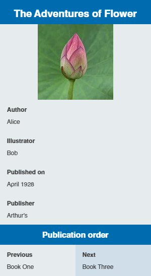

## Тег ``<infobox>``

### CSS-стили

По умолчанию: ``portable-infobox pi-background pi-europa pi-theme-wikia pi-layout-default``.

### HTML-код

```html
<!-- UCP -->
<aside role="region" class="portable-infobox pi-background pi-europa pi-theme-wikia pi-layout-default">
	...
</aside>

<!-- Wikia/FANDOM -->
<aside class="portable-infobox pi-background pi-europa pi-theme-wikia pi-layout-default">
	...
</aside>
```

### Родительские элементы

*Отсутствуют*

### Дочерние элементы

* title
* image
* header
* navigation
* data
* group
* panel

### Параметры

#### theme

Применяет к инфобоксу стиль, прописанный в CSS как `theme`. В CSS прописывается стиль в формате `.pi-theme-$1`. Данный параметр не перекрывает параметры `theme-source` или `type`.

#### theme-source

Позволяет задавать инфобоксу стиль, в зависимости от содержимого какой-либо строки внутри инфобокса. В CCS прописывается как `.pi-theme-$1`. Данный параметр не перекрывает значения параметров `theme` или `type`.

#### type

Позволяет задать инфобоксу некий логический стиль. В CSS прописывается как `.type-$1`. Данный параметр не перекрывает параметры `theme` или `theme-source`.

#### accent-color-source

Используется для акцентного цвета инфобокса (перекрывающего другие стили).

#### accent-color-default

Акцентный цвет инфобокса по умолчанию. Можно прописать цвет в стандартном коде `#f00` или `#ff0000`.

#### accent-color-text-source

Используется для акцентного цвета текста.

#### accent-color-text-default

Используется для акцентного цвета текста по умолчанию. Можно прописать цвет в стандартном коде `#f00` или `#ff0000`.

#### layout

Может быть двух вариантов: `default` или `stacked`. Используется для форматирования текста внутри инфобокса.

##### Код инфобокса

* default: `<infobox layout="default">`
* stacked: `<infobox layout="stacked">`

##### CSS-стили

* default: `pi-layout-default`
* stacked: `pi-layout-stacked`

|  |  |
| --------------------------- | --------------------------- |
| *default*                   | *stacked*                   |

#### name

Внутреннее название для элементов инфобокса. Связано с кодом `data-item-name` в HTML.

### См. также

* [Тег `<infobox>`. CSS](infobox_css.md)
* ["Справка:Инфобоксы/теги" на Вики Сообщества](https://community.fandom.com/ru/wiki/%D0%A1%D0%BF%D1%80%D0%B0%D0%B2%D0%BA%D0%B0:%D0%98%D0%BD%D1%84%D0%BE%D0%B1%D0%BE%D0%BA%D1%81%D1%8B/%D1%82%D0%B5%D0%B3%D0%B8)